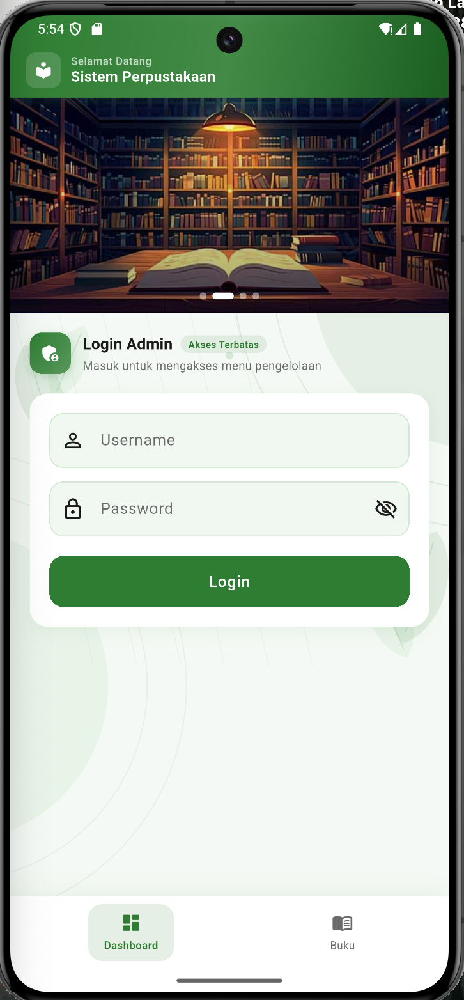
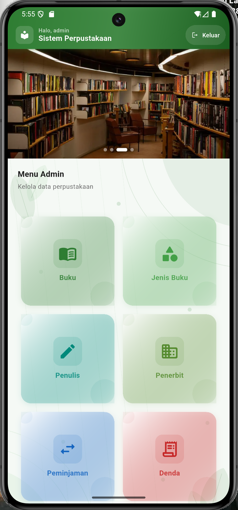
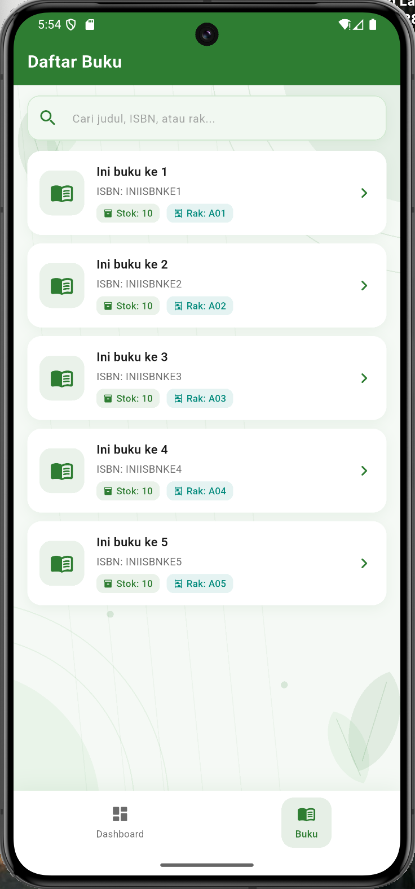
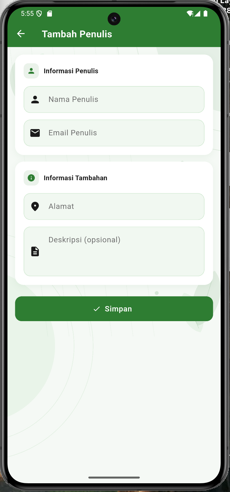
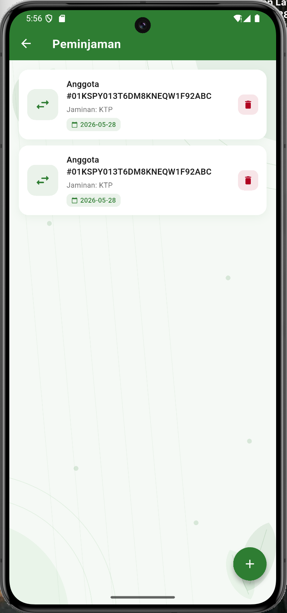
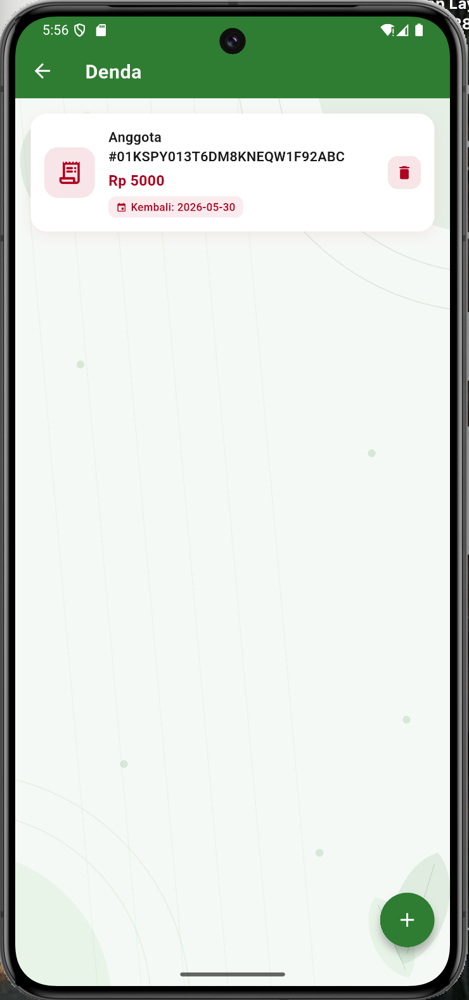
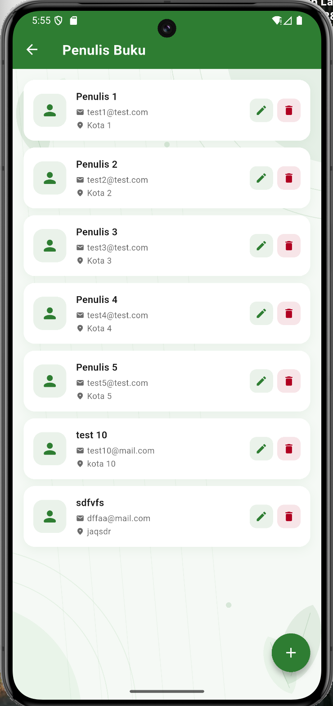

# Perpustakaan App — Flutter

Aplikasi manajemen perpustakaan berbasis Flutter yang mengkonsumsi REST API dari [Golang-Perpustakaan-Restful-API](https://github.com/afrizal423/Golang-Perpustakaan-Restful-API).

---

## Screenshots

| Login | Dashboard |
|---|---|
|  |  |

| List Buku | Form Create |
|---|---|
|  |  |

| List Peminjaman | List Denda |
|---|---|
|  |  |

| Penulis Buku |
|---|
|  |
```


## Stack

| Bagian | Teknologi |
|---|---|
| Frontend | Flutter |
| State Management | Provider |
| HTTP Client | Dio |
| Local Storage | shared_preferences |
| Backend | Golang (Fiber + GORM + MySQL) |
| Auth | JWT |

---

## Fitur

- Login dengan JWT
- CRUD Buku
- CRUD Jenis Buku
- CRUD Penulis Buku
- CRUD Penerbit Buku
- CRUD Peminjaman (+ Detail Peminjaman)
- CRUD Denda
- Auto redirect ke halaman Login jika sesi habis
- Bottom Navigation (Dashboard, Buku, Peminjaman, Denda)
- Dashboard dengan menu master (Jenis Buku, Penulis, Penerbit, Buku)
- Banner auto-scroll tiap 5 detik

---

## Struktur Folder

    lib/
    ├── core/
    │   ├── config/       # app_config.dart (baseUrl)
    │   ├── network/      # dio_client.dart (JWT interceptor)
    │   ├── theme/        # app_theme.dart, bg_painter.dart
    │   └── utils/        # token_helper.dart, dio_error_parser.dart
    ├── models/           # base_response, auth, buku, jenis_buku, dst
    ├── services/         # API calls per modul
    ├── providers/        # State management per modul
    └── screens/
        ├── auth/         # login_screen.dart
        ├── buku/
        ├── jenis_buku/
        ├── penulis_buku/
        ├── penerbit_buku/
        ├── peminjaman/
        └── denda/

---

## Setup Backend (Golang)

**Prasyarat:** Go 1.18+, MySQL, Git

```bash
git clone https://github.com/afrizal423/Golang-Perpustakaan-Restful-API
cd Golang-Perpustakaan-Restful-API
cp .env.example .env
```

Edit `.env`:

```env
DB_HOST=localhost
DB_PORT=3306
DB_USER=root
DB_PASSWORD=yourpassword
DB_NAME=perpustakaan
APP_PORT=8001
```

```bash
go run main.go
```

---

## Setup Flutter

**Konfigurasi Base URL** di `lib/core/config/app_config.dart`:

```dart
// Android Emulator
static const String baseUrl = 'http://10.0.2.2:8001/api/v1';

// Physical Device — ganti dengan IP komputer
static const String baseUrl = 'http://192.168.x.x:8001/api/v1';
```

**Catatan Android** — tambahkan di `AndroidManifest.xml`:

```xml
<application
    android:usesCleartextTraffic="true"
    ...>
```

```bash
flutter pub get
flutter run
```

---

## Dependencies

```yaml
dio: ^5.4.0
provider: ^6.1.1
shared_preferences: ^2.2.2
cupertino_icons: ^1.0.2
```

---

## Bug yang Ditemukan & Diperbaiki di Backend

### 1. Spasi di struct tag `AlamatPenerbit`
**File:** `internal/infrastructure/http/v1/buku/buku_request/penerbit_buku_request.go`

```go
// Sebelum
AlamatPenerbit string ` json:"alamat_penerbit" validate:"required"`
// Sesudah
AlamatPenerbit string `json:"alamat_penerbit" validate:"required"`
```
Spasi ekstra di struct tag menyebabkan Go gagal parse `alamat_penerbit` dari request body. Create & Update penerbit selalu error.

---

### 2. Nama field `IDpeminjaman` (huruf p kecil)
**File:** `internal/core/domain/peminjaman.go`

```go
// Sebelum
IDpeminjaman string `gorm:"column:id_peminjaman;size:26" json:"id_peminjaman"`
// Sesudah
IDPeminjaman string `gorm:"column:id_peminjaman;size:26" json:"id_peminjaman"`
```
GORM gagal resolve foreign key antara `DetailPinjam` dan `Peminjaman` karena Go case-sensitive untuk exported field.

---

### 3. Nama relasi Preload salah di `GetDetailPeminjaman`
**File:** `internal/infrastructure/repository/mysql/peminjaman/peminjaman_repository.go`

```go
// Sebelum
r.db.Preload("Anggota").Preload("DtPeminjaman.BukuDetail").First(...)
// Sesudah
r.db.Preload("Anggota").Preload("Details.BukuDetail").First(...)
```
Nama relasi salah menyebabkan HTTP 500 setiap kali endpoint `GET /admin/peminjaman/detail/:id` dipanggil.

---
